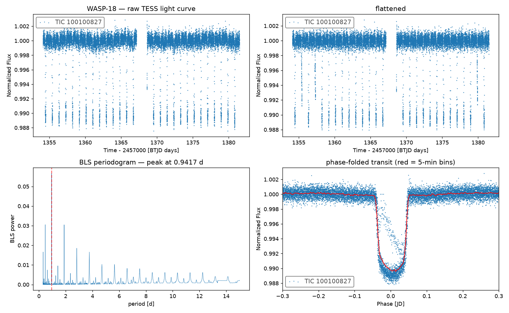
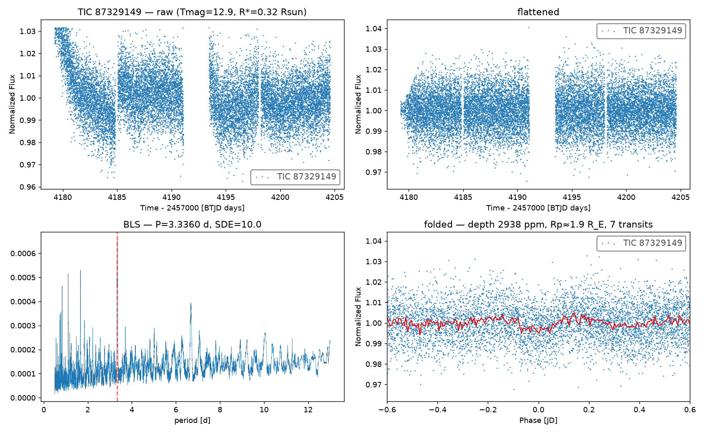

# exoplanet-hunt

A transit search for **new exoplanet candidates** in the freshest public TESS
data — targeting stars that appear in **no TOI list, no community-candidate
list, and no confirmed-planet table**.

Built and run end-to-end on a laptop: real NASA data in, vetted candidates
(and one honest null result) out.


*Pipeline validation: WASP-18 b recovered from raw TESS data at its published
0.94-day period (S/N 25). Panels: raw light curve, detrended, BLS periodogram,
phase-folded transit.*

## The idea

TESS keeps observing, but the official TOI alert pipeline lags the newest
sector releases, and small faint stars get the least follow-up scrutiny.
This project searches the most recently released TESS sector (**sector 104**,
observed May 2026, 12,996 two-minute-cadence light curves) and cross-matches
every signal against three live catalogs:

- ExoFOP **TOI** list (official TESS candidates)
- ExoFOP **CTOI** list (community-reported candidates)
- NASA Exoplanet Archive **confirmed planets**

A strong transit signal on a star in none of them is a genuinely new
candidate. Target selection favors M/K dwarfs (R★ < 0.75 R☉, Teff < 4800 K,
Tmag < 14): the smaller the star, the deeper the transit a given planet
produces.

## Results — first sweep (August 2026)

**400 unflagged M/K dwarfs searched. 56 raw detections → 7 vetted candidates
→ 0 above the discovery bar.**

| Stage | Count |
|---|---|
| Stars searched | 400 |
| No signal | 292 |
| Eclipsing binaries rejected (secondary eclipse / odd–even depth) | 52 |
| Raw BLS detections | 56 |
| After physical vetting (duty cycle, grid edge, phase-0.5, systematics dedup) | **7** |
| Above TLS discovery bar (SDE ≥ 9, FAP < 10⁻³) | **0** |

None of the 7 appears in any TOI, CTOI, or confirmed-planet list. All orbit
red dwarfs (0.19–0.33 R☉) with implied planet radii of 0.9–3.4 R⊕ — but
their TLS significances (SDE 5.1–6.8, false-alarm probability 1–9 %) sit in
the regime where correlated noise dominates, so the honest single-sector
verdict is **no secure new candidate**. Full table: `candidates/vetted.csv`;
per-candidate diagnostics in `figures/`.

Two watchlist objects came closest:

| TIC | Period | Depth | Implied radius | TLS SDE |
|---|---|---|---|---|
| 260817968 | 1.26 d | 9000 ppm | ~3.4 R⊕ | 6.8 |
| 87329149 | 3.34 d | ~3000 ppm | ~1.9 R⊕ | 6.7 |

`followup.py` finds neither has archival 2-min sectors (104 is their first),
so both stay unresolved until TESS revisits the field.


*Watchlist object TIC 87329149: seven ~3000 ppm dips at P = 3.34 d on a
0.32 R☉ red dwarf — suggestive, but below the significance bar.*

## Pipeline

1. **`build_sample.py`** — parse the sector's MAST bulk-download manifest,
   drop every TIC already flagged anywhere, pull stellar parameters from the
   TESS Input Catalog, rank the remainder (12,689 unflagged stars →
   400-target M/K-dwarf sample).
2. **`hunt.py`** — per star: download the SPOC PDCSAP light curve, clean,
   detrend, Box Least Squares period search (0.5–13 d), then vet:
   detection strength (SDE ≥ 8), ≥ 2 distinct transits, depth ≤ 10 %,
   odd/even transit depth consistency, no secondary eclipse.
   Resumable: reruns skip already-searched stars.
3. **`vet.py`** — physical cuts (transit duty cycle < 10 %, off the period
   grid edge, no phase-0.5 anomaly, cross-star systematics dedup), then a
   Transit Least Squares fit per survivor — a limb-darkened transit model
   giving an independent SDE and false-alarm probability.
4. **`followup.py`** — multi-sector re-check of marginal candidates.
5. **`validation/find_exoplanets.py`** — the same method on known planets:
   recovers WASP-18 b (P = 0.9417 d vs 0.9415 d published, S/N 25) and
   LHS 3844 b (P = 0.4629 d, exact, S/N 35). It does **not** recover the
   ~300 ppm transit of π Men c from one sector, which sets the detection
   floor at roughly 1000 ppm — Earth-size and larger around the M dwarfs
   targeted here.

## Reproduce

```bash
python3 -m venv .venv
.venv/bin/pip install -r requirements.txt

# live catalogs (not committed; they change daily):
curl -s "https://exofop.ipac.caltech.edu/tess/download_toi.php?sort=toi&output=csv" -o data/toi.csv
curl -s "https://exofop.ipac.caltech.edu/tess/download_ctoi.php?sort=ctoi&output=csv" -o data/ctoi.csv
curl -s "https://exoplanetarchive.ipac.caltech.edu/TAP/sync?query=select+pl_name,hostname,tic_id,disc_facility,disc_year+from+pscomppars&format=csv" -o data/confirmed.csv
curl -s "https://archive.stsci.edu/missions/tess/download_scripts/sector/tesscurl_sector_104_lc.sh" -o data/sector104_lc.sh

.venv/bin/python build_sample.py
.venv/bin/python hunt.py        # ~1 h for 400 stars; resumable
.venv/bin/python vet.py
```

Environment notes (macOS / Python 3.13): the venv needs a `sitecustomize.py`
containing `import _distutils_hack; _distutils_hack.add_shim()` so that
batman (a TLS dependency) can import `distutils`; and TLS spawns
multiprocessing workers, so every entry script keeps its body under
`if __name__ == "__main__"`.

## Honest caveats

- A surviving signal is a **candidate**, not a discovery. Ruling out
  background eclipsing binaries needs pixel-level centroid checks and
  usually ground-based follow-up (that's what ExoFOP is for).
- The SPOC pipeline team searches these same light curves; the edge here is
  timing (TOI alerts lag new sectors) and depth of scrutiny on faint cool
  dwarfs, not access to secret data.
- Single-sector search: only periods ≲ 13 d give the required two transits.

## Data & credits

Light curves: NASA TESS mission, SPOC pipeline, via MAST. Candidate lists:
ExoFOP-TESS (TOI, CTOI). Confirmed planets: NASA Exoplanet Archive.
Core tools: [lightkurve](https://docs.lightkurve.org/), astropy
BoxLeastSquares, [transitleastsquares](https://github.com/hippke/tls).

MIT license.
